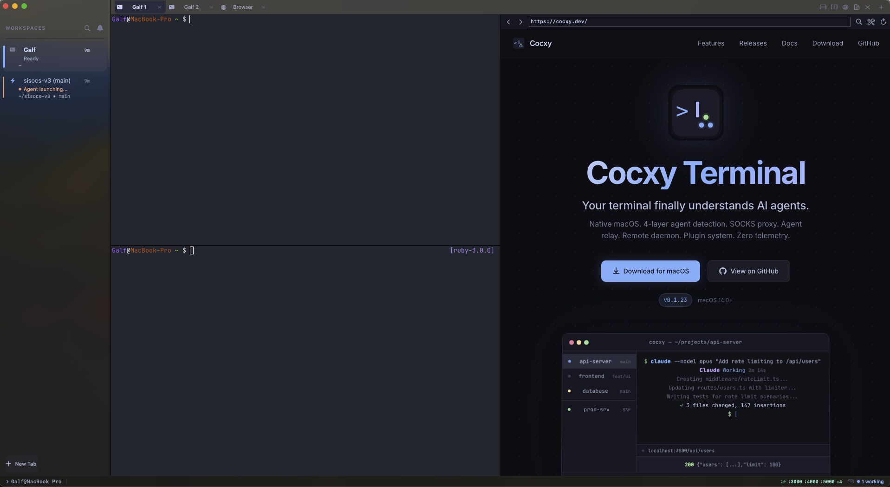

# Cocxy Terminal

[](https://github.com/salp2403/cocxy-terminal/actions/workflows/ci.yml)
[](https://github.com/salp2403/cocxy-terminal/releases/latest)
[](LICENSE)
[](https://www.apple.com/macos/)
[](https://swift.org)
[](#zero-telemetry)
[](https://github.com/salp2403/cocxy-terminal/stargazers)

**The native macOS terminal that understands your AI coding agents.** GPU-accelerated rendering, real-time multi-agent detection, inline agent code review, a full native Markdown workspace, persistent remote sessions, and absolute zero telemetry.

Cocxy knows when your coding agent is thinking, working, waiting for input, or done. It shows you — so you stop watching terminals and start shipping code.

<p align="center">
  
</p>

## Table of Contents

- [Why Cocxy](#why-cocxy)
- [Install](#install)
- [Features](#features)
- [Keyboard Shortcuts](#keyboard-shortcuts)
- [Supported Agents](#supported-agents)
- [Configuration](#configuration)
- [CLI Companion](#cli-companion)
- [Building from Source](#building-from-source)
- [Architecture](#architecture)
- [Contributing](#contributing)
- [Security](#security)
- [License](#license)

## Why Cocxy

Every terminal shows you text. Cocxy shows you what your agent is actually doing. It detects six coding agents across four independent detection layers, gives you a live dashboard of every session, lets you review an agent's changes inline before shipping them, and ships with a native Markdown workspace for notes, plans, and docs. When your agent finishes a task at 3 AM, Cocxy knows — and you know.

Built from scratch in Swift and Metal. No Electron. No web view wrapping a terminal. No data leaves your machine. Just a fast, native macOS app designed for the way developers work in 2026.

## Install

### Homebrew (recommended)

```bash
brew tap salp2403/tap && brew install --cask cocxy
```

Update:

```bash
brew update && brew upgrade --cask cocxy
```

> `brew update` syncs the tap before upgrading. Without it, third-party taps may not detect new versions.

### Direct Download

Download the latest `.dmg` from the [Releases](https://github.com/salp2403/cocxy-terminal/releases) page. Universal builds for Apple Silicon (native) and Intel.

### Nightly Channel

Opt into early builds with experimental features. Nightly builds install side-by-side with the stable version using a separate bundle ID and update feed.

### Build from Source

See [Building from Source](#building-from-source) below.

## Features

### Multi-Layer Agent Detection

Passive detection engine that identifies coding agent state in real time without intercepting or modifying agent traffic. Four independent layers cross-validate for high-confidence results.

| Layer | Method | What It Detects |
|-------|--------|-----------------|
| **Hooks** | Agent event streaming | Tool calls, responses, session lifecycle, subagent spawn |
| **OSC** | Terminal escape sequences | Working directory, title changes, semantic prompts (OSC 133) |
| **Pattern** | Output pattern matching | Launch signatures, waiting prompts, completion markers |
| **Timing** | Activity heuristics | Active vs idle periods, session boundaries |

- **Six Agents** — Claude Code (full hook parity), Codex CLI, Gemini CLI, Aider, Kiro, OpenCode
- **Multi-Agent Hook Support** — Shared hook protocol across Claude Code, Codex, Kiro, Gemini, and custom sources, with per-agent attribution
- **`cocxy setup-hooks`** — Auto-configures hooks in every installed agent with one command
- **Agent Dashboard** — Live view of all sessions with state, working directory, active tool, duration, file touches, and error counts (`Cmd+Option+A`)
- **Agent Timeline** — Chronological event log with six filters (All / Tools / Errors / Agents / Tasks / Session), JSON and Markdown export (`Cmd+Shift+T`)
- **Smart Routing** — Jump between agent sessions by priority, state, or recency (`Cmd+Shift+U`)
- **Agent State Indicator** — Per-tab status dot (working, waiting, finished, error, idle) and an inline ring around the active surface

### Agent Code Review Panel

A native panel to review every change an agent made, comment inline, and feed corrections back to the agent — all without leaving Cocxy.

- **Diff viewer** — File tree with status icons (added, modified, deleted, renamed), unified diff with line numbers, and per-author chips for each file
- **Inline comments** — Click any line in the gutter, type a comment, press Enter; the comment bubble anchors under that line
- **Feedback loop** — Submit all pending comments to the agent through the PTY; the agent picks up the formatted feedback and re-runs the task
- **Accept / reject per hunk** — Granular control via `git apply` (`--cached` to accept, `--reverse` to reject)
- **Keyboard-first** — `j` / `k` hunks, `n` / `p` files, `c` comment, `a` / `r` accept / reject, `d` toggle mode, `Cmd+Enter` submit all
- **Auto-trigger** — Panel opens automatically when the agent session ends (configurable)
- **Cross-tab-safe** — Feedback always reaches the agent in the tab the review belongs to, even if you switched tabs

Open with `Cmd+Option+R` or `cocxy review`.

### Native Markdown Workspace

A first-class Markdown panel that renders in a split pane next to your terminal. Written from scratch in pure Swift — no external parser dependency.

- **Editable source view** — Cmd+B / Cmd+I / Cmd+K formatting, AppKit Find bar, undo / redo, debounced auto-save, file watcher deduplication
- **Live preview** — WKWebView-backed preview with Mermaid diagrams, KaTeX math, GitHub Flavored Markdown, fifteen callout types, footnotes, highlight / superscript / subscript, 200+ emoji shortcodes, reference-style links, setext headings
- **Split mode** — Source and preview side by side with scroll sync
- **Outline sidebar** — Heading tree navigation (`Cmd+Shift+O`)
- **File explorer** — Browse a project's Markdown files with rename, move-to-trash, reveal-in-Finder
- **Full-text search** — Multi-file search across the workspace with debounced results
- **Git integration** — Blame and diff views built in
- **Slide exporter** — Split a Markdown file into a slide deck by horizontal rules, preserving original formatting
- **Copy as** — Markdown, HTML, rich text (RTF), or plain text
- **Image handling** — Drag-and-drop to insert, paste PNG / TIFF from clipboard, lightbox on click, base64 inlining for standalone HTML exports
- **Interactive checkboxes** — Toggle task list checkboxes directly in the preview; changes write back to the source
- **Click-to-source** — Double-click any block in the preview to jump to its line in the source editor
- **Syntax highlighting** — Highlight.js bundled offline with zero network dependency
- **Sortable tables** — Click any column header; numeric-aware, three-state sort
- **Copy tables as TSV** — One-click copy for pasting into spreadsheets
- **[TOC]** — Inline table-of-contents placeholder generates from document headings

### QuickLook Preview Extension

A system-integrated extension that renders `.md` files directly in macOS Finder's QuickLook, with the same Mermaid, KaTeX, callouts, and syntax highlighting as the in-app preview. Zero network, zero dependencies, sandboxed.

### GPU Terminal Engine (CocxyCore)

A custom terminal engine built in Zig, running on Metal. Cross-platform-ready (macOS and Linux) with a stable C ABI.

- **Metal-accelerated rendering** — 120 fps smooth scrolling with a GPU-backed glyph atlas
- **Font ligatures** — OpenType ligatures via CoreText shaping with a configurable toggle
- **Inline image protocols** — Sixel and graphics-protocol image display in the terminal with configurable memory limits
- **GPU-accelerated regex search** — Native scrollback search with a Swift fallback for compatibility
- **Protocol v2** — Structured extension protocol for bidirectional agent-to-terminal communication
- **Multi-stream support** — Split PTY output into named streams addressable from the CLI
- **Mode diagnostics** — Inspect cursor, alt-screen, application cursor mode, and semantic block state from the CLI

### Remote Workspaces

SSH multiplexing with persistent sessions, proxy management, agent relay, and a remote daemon — all from the client, zero installation required on the server.

- **Persistent sessions** — tmux-backed sessions on remote hosts that survive SSH disconnects
- **Session management UI** — Visual panel to create, list, attach, and kill remote sessions
- **SSH multiplexing** — OpenSSH ControlMaster for connection reuse across tabs
- **Port tunneling** — Local, remote, and dynamic SOCKS forwarding with conflict detection
- **SOCKS5 + HTTP CONNECT proxy** — Native proxy with system-wide macOS integration, PAC generation, exclusion lists, and health monitoring with auto-failover
- **Agent relay** — Multi-channel reverse tunnels with HMAC-SHA256 auth, per-channel ACL, audit logging, token rotation, and Keychain persistence
- **Remote daemon** — POSIX shell daemon with three-level session fallback (tmux / screen / native PTY), persistent port forwards, file sync watching, and 24-hour auto-cleanup
- **SFTP browser** — Navigate and transfer files on remote hosts
- **Auto-reconnect** — Exponential backoff reconnection with configurable retry limits

### Built-in Browser

In-app browser for previewing dev servers, reading docs, and inspecting web output without switching apps.

- **Profiles** — Isolated cookies, storage, and history per profile
- **DevTools** — Console, Network, and DOM inspection
- **Bookmarks** — Organized with nested folders
- **Split or overlay** — Side by side with the terminal or as a floating panel
- **Downloads** — Tracked with progress and open-on-complete

### Web Terminal

Expose any local terminal over HTTP with a zero-dependency web frontend. Useful for quick peer programming or remote assistance.

- Tunable frame rate, on-demand full frame refresh, connection counts
- Per-terminal attach / detach with a single CLI command
- Events exposed to plugins for custom integrations

### Per-Project Configuration

Drop a `.cocxy.toml` file in any project root to override global settings per directory.

```toml
# .cocxy.toml
font-size = 13
background-opacity = 0.95

[agent-detection]
extra-launch-patterns = ["^python manage.py"]
```

Cocxy detects and applies the project config automatically when you `cd` into a directory. Hot-reload on file changes.

### AppleScript Automation

Full AppleScript vocabulary for workflow automation and integration with Shortcuts, Automator, and Raycast.

```applescript
tell application "Cocxy Terminal"
    make new tab with properties {command:"ssh deploy@prod"}
    set name of tab 1 to "Production"
end tell
```

### Plugin System

Event-driven plugin architecture for extending Cocxy with custom integrations.

```
~/.config/cocxy/plugins/
  my-plugin/
    manifest.toml
    on-session-start.sh
    on-agent-detected.sh
```

Plugins respond to eight terminal events: session start / end, agent detected, state changed, command complete, tab created / closed, directory changed. Scripts run in a sandboxed environment with timeout enforcement.

### Tabs, Splits, and Windows

- **Vertical sidebar** with git branch, agent state, and activity timing
- **Horizontal and vertical splits** with keyboard navigation and equalization
- **Mixed panels** — A single workspace can contain terminals, Markdown panels, and browser panels side by side
- **Session persistence** — Tabs, splits, directories, and window state restored on relaunch
- **Multi-window** — Every window is independent; sessions sync across them
- **Quick Terminal** — Global dropdown available from any app (`` Cmd+` ``)

### Command Palette and Scrollback Search

- **Command Palette** — Fuzzy search across every command, action, and setting (`Cmd+Shift+P`)
- **Scrollback search** — Live search with debounced results and native engine acceleration (`Cmd+F`)

### Shell Integration

Native shell integration for zsh, bash, and fish — installed automatically, no setup required. Preserves user frameworks (Prezto, Oh My Zsh, YADR, starship) without modification.

- OSC 7 working-directory reporting with URI encoding
- OSC 133 semantic prompts for command boundaries and duration
- Safe environment-variable injection that restores originals in every subshell

### Zero Telemetry

Cocxy sends **zero data** to any external server. No analytics. No crash reporting. No tracking. No exceptions. Your terminal activity stays on your machine. Verify with any network monitor.

## Keyboard Shortcuts

| Action | Shortcut |
|--------|----------|
| New Tab | `Cmd+T` |
| Close Tab | `Cmd+W` |
| New Window | `Cmd+N` |
| Command Palette | `Cmd+Shift+P` |
| **Agent Code Review Panel** | **`Cmd+Option+R`** |
| Agent Dashboard | `Cmd+Option+A` |
| Agent Timeline | `Cmd+Shift+T` |
| Smart Routing | `Cmd+Shift+U` |
| Notifications | `Cmd+Shift+I` |
| Browser Panel | `Cmd+Shift+B` |
| Remote Workspaces | `Cmd+Shift+R` |
| Markdown Outline (when active) | `Cmd+Shift+O` |
| Markdown Source / Preview / Split | `Cmd+1` / `Cmd+2` / `Cmd+3` |
| Find in Terminal / Markdown | `Cmd+F` |
| Split Horizontal | `Cmd+D` |
| Split Vertical | `Cmd+Shift+D` |
| Equalize Splits | `Cmd+Shift+E` |
| Toggle Split Zoom | `Cmd+Shift+F` |
| Close Split | `Cmd+Shift+W` |
| Navigate Splits | `Cmd+Option+Arrows` |
| Quick Terminal | `` Cmd+` `` |
| Zoom In / Out | `Cmd++` / `Cmd+-` |
| Next Tab | `Cmd+Shift+]` |
| Previous Tab | `Cmd+Shift+[` |
| Jump to Tab 1–9 | `Cmd+1` through `Cmd+9` |
| Dismiss Overlay | `Esc` |

## Supported Agents

| Agent | Hooks | OSC 7 / 133 | Pattern | Timing |
|-------|-------|-------------|---------|--------|
| Claude Code | Yes (full event set) | Yes | Yes | Yes |
| Codex CLI | Yes | — | Yes | Yes |
| Gemini CLI | Yes (mapped events) | — | Yes | Yes |
| Aider | — | — | Yes | Yes |
| Kiro | Yes | — | Yes | Yes |
| OpenCode | — | — | Yes | Yes |

Custom agents are defined in `~/.config/cocxy/agents.toml`:

```toml
[my-agent]
display-name = "My Agent"
osc-supported = false
launch-patterns = ["^my-agent\\b"]
waiting-patterns = ["^>\\s*$"]
error-patterns = ["Error:"]
finished-indicators = ["^\\$\\s*$"]
idle-timeout-override = 10
```

## Configuration

```
~/.config/cocxy/
  config.toml          Fonts, theme, keybindings, terminal behavior
  agents.toml          Agent detection patterns and thresholds
  themes/*.toml        Custom themes
  plugins/             Plugin directories with manifest.toml
  sessions/            Auto-saved session state
  remotes/             SSH connection profiles
  sockets/             SSH ControlMaster socket files
```

### Example `config.toml`

```toml
[font]
family = "JetBrains Mono"
size = 14.0

[theme]
name = "catppuccin-mocha"
light-theme = "catppuccin-latte"

[terminal]
scrollback-lines = 10000
cursor-style = "block"
cursor-blink = true
copy-on-select = true
clipboard-paste-protection = true

[appearance]
background-opacity = 1.0
background-blur-radius = 0
window-padding-x = 2
window-padding-y = 2
ligatures = true

[code-review]
auto-show-on-session-end = true
```

### Themes

Ships with Catppuccin (Mocha and Latte), One Dark, and Solarized (Dark and Light). Drop a `.toml` theme into `~/.config/cocxy/themes/` and it appears immediately in the theme picker. Auto-switching between a light and dark pair follows the system appearance.

## CLI Companion

Ninety-three commands for scripting and automation via a Unix Domain Socket with per-UID authentication.

```bash
cocxy setup-hooks                # Auto-configure hooks across every installed agent
cocxy notify "Deploy complete"   # Trigger a native notification with optional sound
cocxy list-tabs                  # List all tabs as JSON
cocxy window list                # List all open windows
cocxy session save my-workspace  # Save current session
cocxy session restore my-workspace
cocxy remote list                # List SSH profiles and status
cocxy remote connect prod-web    # Connect to a remote profile
cocxy plugin list                # List installed plugins
cocxy dashboard toggle           # Toggle the agent dashboard
cocxy timeline export --format json > events.json
cocxy review                     # Toggle the agent code review panel
cocxy review --submit            # Submit pending review comments to the agent
cocxy capture-pane               # Capture terminal content as text
cocxy send --stdin               # Read input from stdin for multiline, escape-safe send
cocxy core-modes                 # Dump terminal diagnostic state (alt-screen, cursor, etc.)
cocxy web-start --port 8080      # Expose the active terminal over HTTP
```

Run `cocxy help` for the full reference.

## Building from Source

### Prerequisites

- macOS 14.0 (Sonoma) or later
- Xcode 16 or later
- Swift 5.10+
- Zig 0.15+ (`brew install zig`) — required to build CocxyCore locally

### Build and Run

```bash
git clone https://github.com/salp2403/cocxy-terminal.git
cd cocxy-terminal

swift build
swift run CocxyTerminal
```

### Test

```bash
swift test
```

### Package a Local `.app`

```bash
./scripts/build-app.sh release
./scripts/install-local-app.sh   # Copies the built bundle into /Applications and registers QuickLook
```

## Architecture

MVVM + Coordinators with Swift protocols as contracts between modules. Zero third-party Swift dependencies in app code; Sparkle is the only packaged binary dependency, used solely for auto-updates.

```
Sources/
  App/               Entry point, AppDelegate, scripting bridge
  Core/              Terminal engine bridge, socket server, renderers
  Domain/
    AgentDetection/    Multi-layer detection engine
    CodeReview/        Diff, comments, hunk actions, feedback loop
    Markdown/          Parser, renderer, outline, search, git integration
    Plugins/           Manifest loader and event dispatch
    RemoteWorkspace/   SSH, proxy, relay, daemon, SFTP
    CommandPalette/    Engine and coordinator
    Timeline/          Event store
    SmartRouting/      Priority-based tab routing
  UI/                Windows, tabs, panels, overlays, animations
CLI/                 cocxy companion tool (ninety-three commands)
QuickLook/           Markdown QuickLook extension
Tests/               Swift Testing suite
Resources/
  Themes/            Built-in color schemes
  Fonts/             Bundled JetBrains Mono and Monaspace Neon Nerd Font
  shell-integration/ zsh, bash, fish scripts
  Markdown/          KaTeX, Mermaid, Highlight.js bundled for offline preview
```

CocxyCore (the terminal engine) lives in a separate repository and is vendored as an `.xcframework` in `libs/` during local development. CI rebuilds it from source.

## Contributing

Contributions are welcome. See [CONTRIBUTING.md](CONTRIBUTING.md) for the full guide: branch naming, commit conventions, test requirements, and code style.

## Security

Found a vulnerability? Do not open a public issue. Email [security@cocxy.dev](mailto:security@cocxy.dev). See [SECURITY.md](SECURITY.md) for the responsible disclosure process.

## License

MIT License. Copyright (c) 2026 Said Arturo Lopez. See [LICENSE](LICENSE).

## Links

- **Website:** [cocxy.dev](https://cocxy.dev)
- **Releases:** [GitHub Releases](https://github.com/salp2403/cocxy-terminal/releases)
- **Changelog:** [CHANGELOG.md](CHANGELOG.md)
- **Documentation:** [cocxy.dev/getting-started.html](https://cocxy.dev/getting-started.html)
- **Issues:** [GitHub Issues](https://github.com/salp2403/cocxy-terminal/issues)
